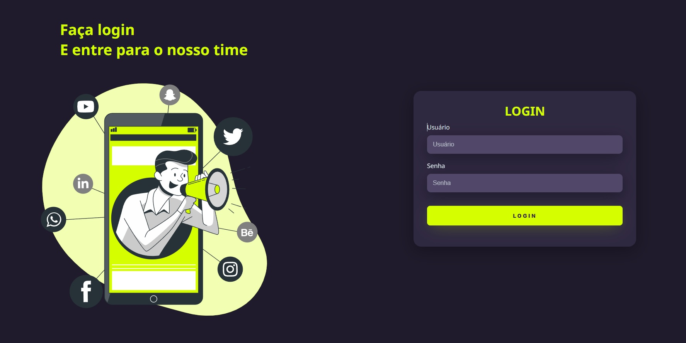

  
  <!--Adicionar logotipo do projeto aqui-->
  

    
  
 

  <h1>Login Screen</h1>
  
Tela de login, utilizando HTML e CSS

  

    
  
 

  <!--Adicionar imagem/gif do projeto aqui-->
  

       
  

  ## 🚀 Iniciar
  - Link da aplicação no GitHub Pages: https://doug-silva.github.io/login-screen
  
  ## 🔨 Seja um dos contribuidores 
  Quer fazer parte desse projeto? Clique [AQUI](CONTRIBUTING.md) e leia como contribuir.

  <a href='#voltar-topo'>⬆ Voltar ao topo</a> 
